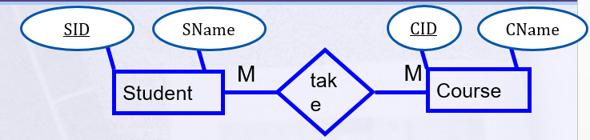
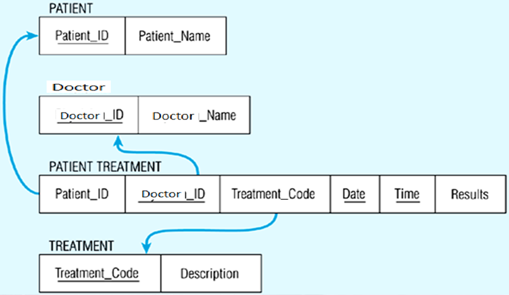

# Mapping in DB

- In this document we discuss Database mapping

- There are some of steps should follow them:

## 1. Mapping For regular Entity

- For each strong entity, create a table that inlcudes all simple attributes.
    - **Example**

        

        
----------------------
- If we have **multivalued attribute**, we converted it by make **two tables:** 
    - The first table for entity and it's attributes without multivalued attribute.
    - Second table for multivalued attribute and put in it the primary key of entity.
    - **Example**

        

        
-------------------
- If we have **Composite attribute**, convert to one table with the components of composite attribute.
    - **Example**

        

        
---------------------
- If we have a **Complex attribute** we convert as multivalued attribute to **two tables** and **second** table consiste the primary key of entity and components of composite attribute.
    - Example

        
        
        

-----------------
- If we have a **drived attribute**, In the most cases Derived attribute not be stored in DB
------------------
## 2. Mapping of Weak Entity Types

- Create table for each weak entity.
- Weak entity has a partial key. 
- make a compostie primary key (partial key + primay key for strong entity)
    - **Example**

        

        

---------------------
## 3. Mapping of Binary 1:1 Relation Types

- Look on participation there are three cases:
    **1. (total - total)**
    - There is one table have attributes for each entity and there are two primary keyschose one of them is a primary key

    - **Example** 

        

        

    ------
    **2. (partial - total)**
    - There are two tables for two entities.
    - Add **Foreign Key** into  table with the total participation relationship  to represent optional side.
    
    - **Example**

        

        
    
    ---------
    **3. (partial - partial)**
    - There are three tables
    - two tables for two entities
    - third table has two primary keys one of them is act as a priamry key.

    - **Example** 

        

        
---------------
## 4. Mapping of Binary 1:N Relationship Types.
- Look participation from N side.
- If participation is partial: 
    - there are **three tables** 
        - two of them for entities.
        - third table consist of the primary keys of two tables and the primary key of the table is N-side table.
        - **Example**

            .png)

            .png)
- If participation is total:
    - There are two tables.
    - The primary key of 1-side is act as foreign key in N-side.
    - **Example**

        .png)

        .png)
------------------
## 5. Mapping of Binary M:N Relationship Types
- Don't Look at participation.
- Create a new third  table.
- Add FKs to the new table for  both parent tables.

- **Example**

    

    .png)

-------------

## 6. Mapping of N-ary Relationship Types.

- If n > 2 then 
    - Create a new third  table
    - Add FKs to the new table for all parent tables
    - **Example**
        
        
--------
## 7. Mapping Unary Relationship

- Create a new attribute act as foreign key refers to primary key in the same table.
- **Example**

    

    

----
### **Note** 
- if there is an attribute on relationship put it in the table that have all primary keys together.